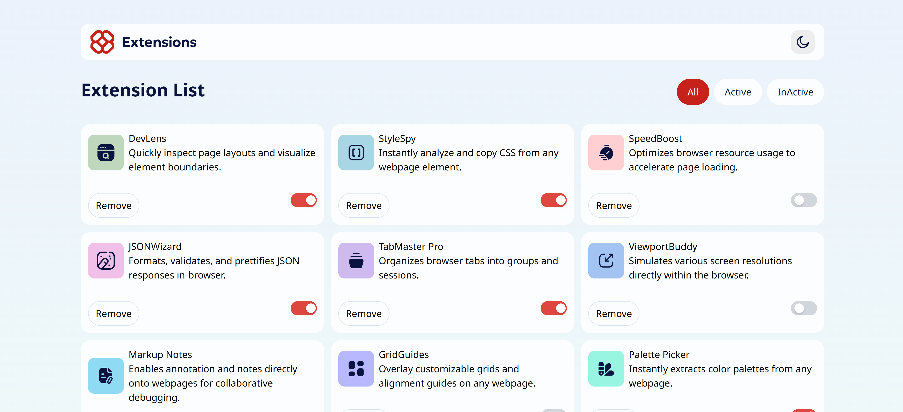

# Frontend Mentor - Browser Extensions Manager UI Solution

This is a solution to the [Browser extensions manager UI challenge on Frontend Mentor](https://www.frontendmentor.io/challenges/browser-extension-manager-ui-yNZnOfsMAp). Frontend Mentor challenges help you improve your coding skills by building realistic projects.

## Table of contents

- [Overview](#overview)
  - [The challenge](#the-challenge)
  - [Screenshot](#screenshot)
  - [Links](#links)
- [My process](#my-process)
  - [Built with](#built-with)
  - [What I learned](#what-i-learned)
  - [Continued development](#continued-development)
  - [Useful resources](#useful-resources)
- [Author](#author)
- [Acknowledgments](#acknowledgments)

## Overview

### The challenge

Users should be able to:

- Toggle extensions between active and inactive states
- Filter active and inactive extensions
- Remove extensions from the list
- Select their color theme
- View the optimal layout for the interface depending on their device's screen size
- See hover and focus states for all interactive elements on the page

### Screenshot



### Links

- Solution URL: [https://github.com/Yishay2/browser-extensions-manager](https://github.com/Yishay2/browser-extensions-manager)
- Live Site URL: [https://your-live-site-url.com](https://your-live-site-url.com)

## My process

### Built with

- Semantic HTML5
- CSS custom properties
- Flexbox
- CSS Grid
- Mobile-first workflow
- [React](https://reactjs.org/)
- [Tailwind CSS](https://tailwindcss.com/)

### What I learned

During this project, I learned how to apply more advanced Tailwind CSS utility classes to improve design consistency and responsiveness. I also improved my component-based architecture in React.

Here's a small snippet I'm proud of:

```html
<button class="px-4 py-2 bg-blue-600 text-white rounded hover:bg-blue-700 transition">
  Toggle Extension
</button>
Continued development
In future projects, I plan to:

Implement more robust filtering and sorting features

Improve accessibility with ARIA attributes and better keyboard navigation

Add tests using Jest and React Testing Library

Useful resources
Tailwind CSS Documentation – Excellent resource for understanding Tailwind’s full potential.

React Docs – Helped me review component structure.

Frontend Mentor Discord – Great place to get feedback.

Author
Name – Yishay Doron Cohen

Frontend Mentor – @Yishay2

GitHub – @Yishay2

LinkedIn – linkedin.com/in/yishay-doron-cohen-6213a0283

Email – ishaicohen125@gmail.com

Acknowledgments
